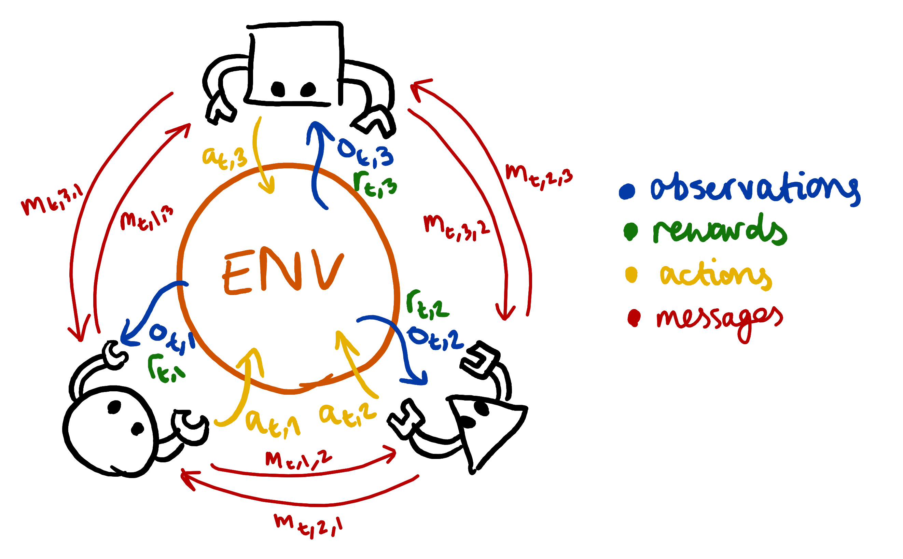
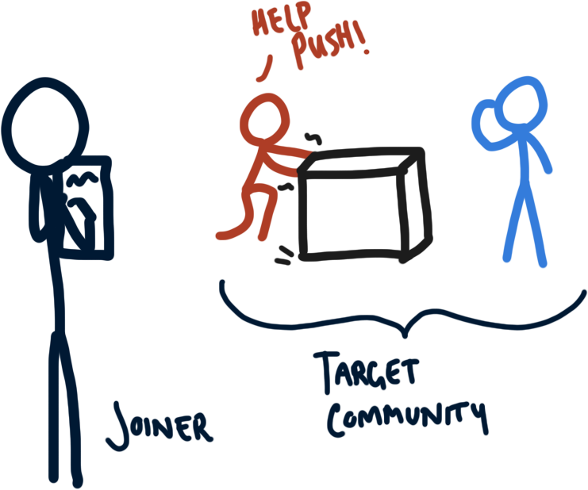

I am a PhD student at King's College London and Imperial College London studying Computer Science in the [Safe and Trusted AI Centre for Doctoral Training](https://safeandtrustedai.org).
Previously, I was a reserach intern at the [Center for Human-Compatible AI (CHAI)](https://www.humancompatible.ai).
My doctoral research is focused on studying language and communication within the context of _Multi-Agent Reinforcement Learning_ (MARL).
I am driven to this line of research by my view (adapted from others) that "intelligence" is a fundamentally social phenomenon, and the language/communication is the key capacity that enables human groups to achieve incredible things.
More broadly, I am interested in how such systems came about naturally, and therefore I find myself thinking and reading a lot about evolutionary biology.

Yet, as philosophically interesting the questions arising from research are, I am also deeply concerned about the current and future impacts of emerging technologies.
I would characterise my views as quite close to Brian Christian's, as outlined in [_The Alignment Problem_](https://www.amazon.com/Alignment-Problem-Machine-Learning-Values/dp/0393635821).
Current ethical and political issues arises from increasingly competent AI systems are continuous with later, more catastrophic risks - and those later risks are much more speculative.
These technologies have the capacity to concentrate power, deepen social divisions, and supercharge oppression, so collective effort is required to ensure this does not happen.

### Doctoral Research

**Overview.** A critical problem in Artificial Intelligence is creating computer agents that can collaborate as a member of a team.
For many problems, communication is a vital part of a team's success. Yet, most treatments of language in AI focus on learning the statistical patterns of words (i.e. the _"language modelling"_ that underpins most AI chatbots).
This is a far cry from the functional uses of language in everyday human cooperation.
In this light, my research focuses on what I call the "Cooperative Language Acquisition Problem": here the task is to create an AI that learns the way a community uses language to accomplish some goal.
Thereby the AI can join the community and help them achieve said goals."

**Background: Reinforcement Learning and Emergent Communication**

In a typical (single-agent) Reinforcement Learning (RL) set-up, an agent interacts with an environment through taking actions based on its observations.
For example, imagine that the agent is a computer program playing a video game.
The observations that it receives could be just like the ones a human player would see, e.g. an image of the game's screen.
Similarly, the actions it could take would be the same as the human; this could correspond to pressing the arrow keys to move or the spacebar to jump.

To train the agent to play the game, we give it rewards when it does something good, and penalties if it does something bad.
We then use clever mathematics and algorithms to have it learn to maximise these rewards.

The multi-agent setting extends this basic set-up to the analogous case of a multiplayer game, where many people connect to a centralised server to cooperate or compete on different problems. For games that require well-executed coordination, communication between players is essential.
We can model this in the MARL framework by allowing agents to send discrete messages to one another at the same time that they take actions in the environment.
The overall setup looks like the following diagram:

When we train a population of agents in this scenario, something quite interesting happens.
At the beginning of training, we as programmers have not assigned any meaning to the messages that the agents can send.
In contrast, with actions we have 'assigned meaning' in the sense that when the agent selection "action 0" we have mapped this to the "spacebar" action that a human would usually press.
And the designers of the game have assigned the spacebar the "meaning" of a jump for the player's character, or something like that depending on the game.

This means that the meaning of messages _emerges_ through the training process. Or in slightly over-anthropomorophic terms: the agents find for themselves a communication system that serves their goals.
We call the area of studying investigating this processes _Emergent Communication_, and since the rise of deep learning for MARL it has had a renewed interest.

### Cooperative Language Acquisition

So with emergent communication we can create a population of agents that solve some task by developing their own communication "language".
Studying the strategies and protolanguages that are developed is interesting in its own right, but an key issue here is that these languages are essentially private.
It is very difficult to decode what the messages mean to the agents, and the agents cannot adapt their communication strategies to new interlocutors.

Thus, my work aims to bridge the gap between language modelling - i.e. learning simply from observations of human language - and emergent communication.
This is where I have posed the challenge of _Cooperative Language Acquisition Problems_, or CLAPs.
In this setting, we are given a dataset of messages sent by a community of agents, actions that the agents took, and we know the problem that they are trying to solve.
Our task then is to build an agent that can _joining in_ with this community to help achieve a shared goal. 

## Other Interests

**Evolutionary Computation.** Evolution is the only process that we know of that can produce the wonderous complexities of the natural world.
From ant colonies to nervous systems, from bee waggle-dances to human language.
I have had a long standing interest in evolution, but it was intensified in early 2022 when I rewatched [Robert Sapolsky's Human Behavioural Biology](https://www.youtube.com/playlist?list=PL848F2368C90DDC3D) lectures and read Neil Shubin's [_Some Assembly Required_](https://www.amazon.com/Some-Assembly-Required-Decoding-Billion/dp/1101871334).
In particular, my renewed interest was focused on the role of _gene regulation_ in the evolution of complex multicellular systems.
Multicellularity is an interesting form of cooperation between individuals, in which their very individuality is given up.
But to coordinate this cooperative endeavour, cells take specialised roles in the organism.
So I revisted a simulation I start in 2016, during my undergraduate.
This side-project ended up becoming a lot more involved than I had original anticipated, and I created a [YouTube video](https://www.youtube.com/channel/UCNxxs-OEF_5xhM8iOX87NSg), wrote [a paper](https://direct.mit.edu/isal/proceedings/isal/35/77/116930) that I presented at ALIFE 2023, and started an Discord community of people interested in the project. You can also read more at this [blog post](https://dylancope.com/protoevo)!

**Science of Deep Learning.** Over the last decade, deep learning has emerged as one of the most powerful tools in building highly-capable AI systems.
Yet, while we understand the principles used to derive the gradient descent algorithm that powers deep learning, we still have a relatively shallow understanding of the learned models.
A fascinating branch of machine learning is in its infancy that aims to fix this, with various subdiscplines encompassing a new _science of deep learning_.
This motivated me and my colleage, Nandi Schoots, to try to understand how [internal representations of features relate to a model's robustness to distributional shift](https://domaingen.github.io/accepted).

---

<a itemprop="sameAs" content="https://orcid.org/0000-0003-1147-8010" href="https://orcid.org/0000-0003-1147-8010" target="orcid.widget" rel="me noopener noreferrer" style="vertical-align:top;">https://orcid.org/0000-0003-1147-8010</a>

[KCL Pure Research Profile](https://kclpure.kcl.ac.uk/portal/en/persons/dylan-cope)
